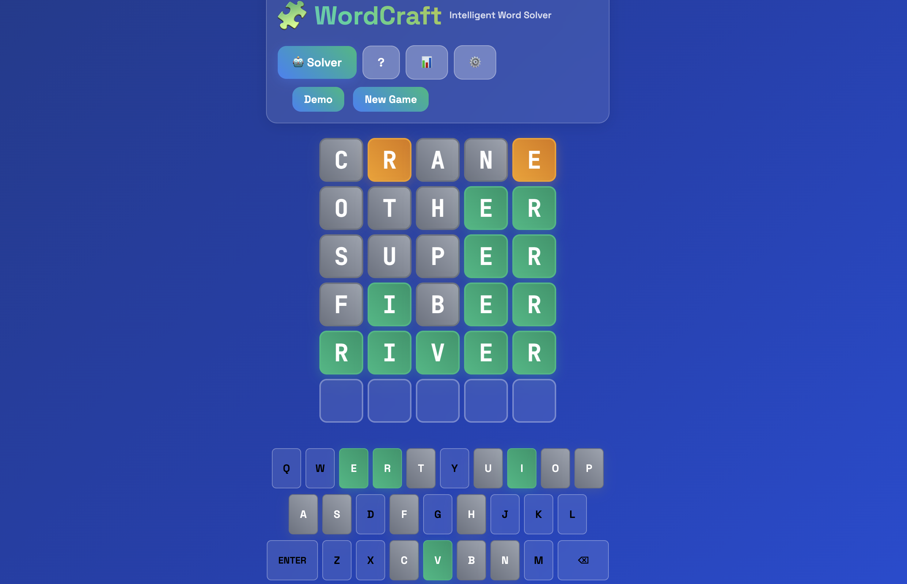
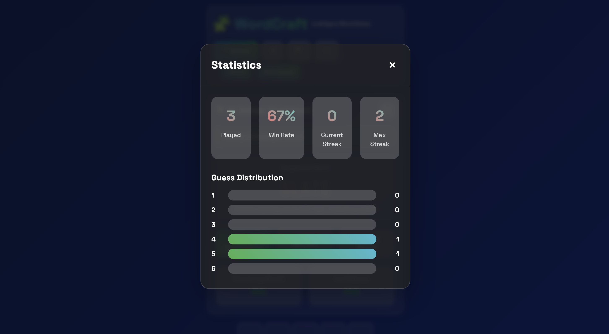
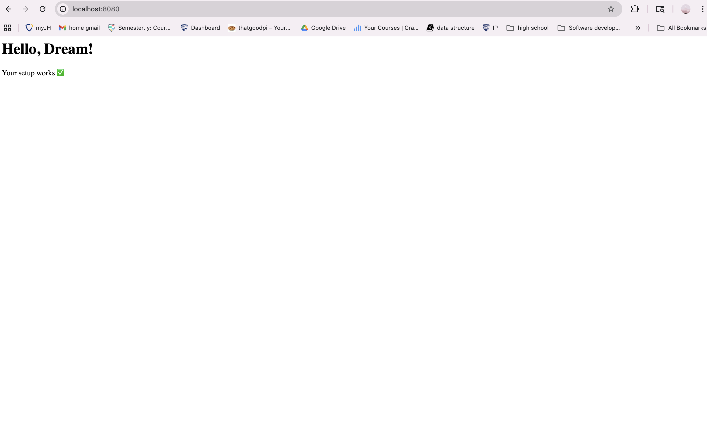

## Purpose of Project
The goal of this project is to build a functional version of Wordle in OCaml. By recreating this popular word-guessing game, we want to practice writing clean, modular code and get comfortable using OCaml’s functional programming style. The project will help us learn how to design separate components for things like checking guesses, managing the dictionary, and keeping track of game progress, all while making sure everything is easy to test and reuse. We’ll start with a simple command-line version and then add a solver and web interface to make it more interactive. Overall, this project is a hands-on way to apply what we’ve learned about software design, testing, and functional programming in a creative and enjoyable way.

## Application Mock Use

## List of Libraries
- Core: standard utilities and functional data structures
- Dream: web server
- OUnit: unit test
- Base quickcheck: randomized testing

Since Core, OUnit, and Base quickcheck are used extensively throughout the assignments, we won't demo here again. See the demo folder for the Dream's demo.

## Implementation Plan

### Week 1 — Project Setup & Core Interfaces
#### Goal: Establish structure and interfaces for variable-length Wordle.
#### Tasks
- Initialize dune project folders: `src/lib/`, `src/bin/`, `ui/`, `test/`, `demo/`
- Define module interfaces (.mli): `feedback`, `dict`, `game`, `solver`
- Write `README.md` describing architecture and Dream integration plan
- Set up minimal Dream app

#### Definition of Done (DoD):
- `dune build` succeeds  
- All `.mli` files compile and are documented  

---

### Week 2 — Feedback, Dictionary & Game Logic
#### Goal: Implement core backend logic supporting variable-length words.
#### Tasks
- Implement `Feedback.compute` with duplicate-letter handling for any length
- Add helpers: `to_emojis`, `all_green`
- Implement `Dict.load`, `Dict.mem`, `Dict.filter_by_length`
- Implement `Game.new_game`, `Game.submit_guess`, `Game.is_over`
- Validate guesses (length, character set, dictionary membership)
- Write Alcotest unit tests for `Feedback`, `Dict`, and `Game`

#### DoD:
- 100% of Feedback and Game tests pass  
- Handles variable word lengths correctly  
- Playable from `utop` (manual testing of backend flow)

---

### Week 3 — Dream Web UI
#### Goal: Build an interactive variable-length Wordle UI with Dream.
#### Tasks
- Implement grid rendering (N×len) with color-coded feedback
- Add input handling for keyboard and onscreen buttons
- Connect `/guess` and `/reset` Dream routes to backend logic
- Maintain session state (secret word, guesses)
- Style with Tailwind or simple CSS for visual clarity

#### DoD:
- Running `dune exec wordle_ui` launches a fully playable browser game  
- Feedback colors and state transitions match backend logic  
- Supports different word lengths (e.g., 4–7 letters)

---

### Week 4 — Solver, Integration & Final Polish
#### Goal: Implement solver and finalize demo.
#### Tasks
- Implement `Solver.filter_words`, `Solver.score_words`, `Solver.best_guess`
- Integrate solver into Dream UI (e.g., “Suggest” button)
- Add documentation and short presentation:
  - Architecture overview
  - Feedback & Solver algorithm explanations
  - Screenshots and sample runs
- Conduct final testing (UI + backend consistency)
- Prepare demo slide deck

#### DoD:
- Fully playable Wordle web app with solver suggestions  
- Fast and consistent solver behavior  
- Final documentation and demo materials complete